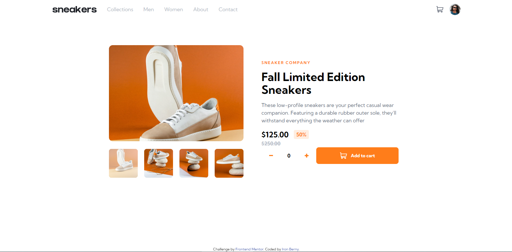

# Frontend Mentor - E-commerce product page solution

This is a solution to the [E-commerce product page challenge on Frontend Mentor](https://www.frontendmentor.io/challenges/ecommerce-product-page-UPsZ9MJp6). Frontend Mentor challenges help you improve your coding skills by building realistic projects.

## Table of contents

- [Overview](#overview)
  - [The challenge](#the-challenge)
  - [Screenshot](#screenshot)
  - [Links](#links)
- [My process](#my-process)
  - [Built with](#built-with)
  - [What I learned](#what-i-learned)
  - [Continued development](#continued-development)
- [Author](#author)

## Overview

### The challenge

Users should be able to:

- View the optimal layout for the site depending on their device's screen size
- See hover states for all interactive elements on the page
- Open a lightbox gallery by clicking on the large product image
- Switch the large product image by clicking on the small thumbnail images
- Add items to the cart
- View the cart and remove items from it

### Screenshot

### Links

- Solution URL: [Solution Url](https://github.com/IronProg/fm-challenge-e-commerce-product)
- Live Site URL: [Add live site URL here](https://your-live-site-url.com)

## My process

### Built with

- Semantic HTML5 markup
- CSS custom properties
- Flexbox
- CSS Grid
- Mobile-first workflow
- CSS Modules
- [React](https://reactjs.org/) - JS library
- [Next.js](https://nextjs.org/) - React framework
- [Tailwind CSS](https://tailwindcss.com/) - For styles

### What I learned

I've learned how to use 'absolute' position CSS property along with a parent with 'relative' position to manipulate elements in the document, also learned a lot of TailwindCSS's workflow.

### Continued development

I'm still feeling a bit lost when manipulating image styles, so that's where I'll be focusing from now on.

## Author

- LinkedIn - [Iron Berny](https://www.linkedin.com/in/iron-berny/)
- GitHub - [IronProg](https://github.com/IronProg/)
- Frontend Mentor - [@IronProg](https://www.frontendmentor.io/profile/IronProg)
